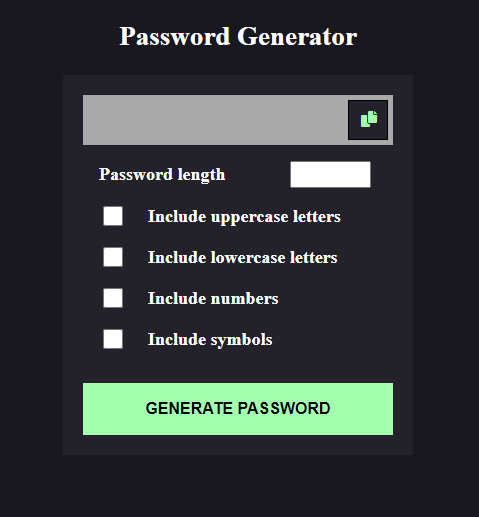
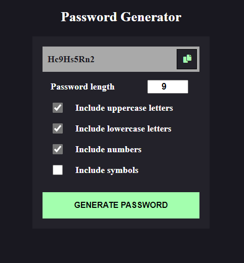

# Random Password Generator App

### Overview
  - [Challenge]
  
  - Generate a password based on the selected inclusion option.
  - Copy the generated password to the clipboard.

### Screenshot

### Links 

- Hosted URL: ()

## built with

- HTML5
- CSS
- JavaScript

### What i learned

This password generator was a fun and challenging to work on. Learnt creating custom checkbox component. Coping the generated password to the clipboard with the help of JavaScript. How it gives random passwords. 

